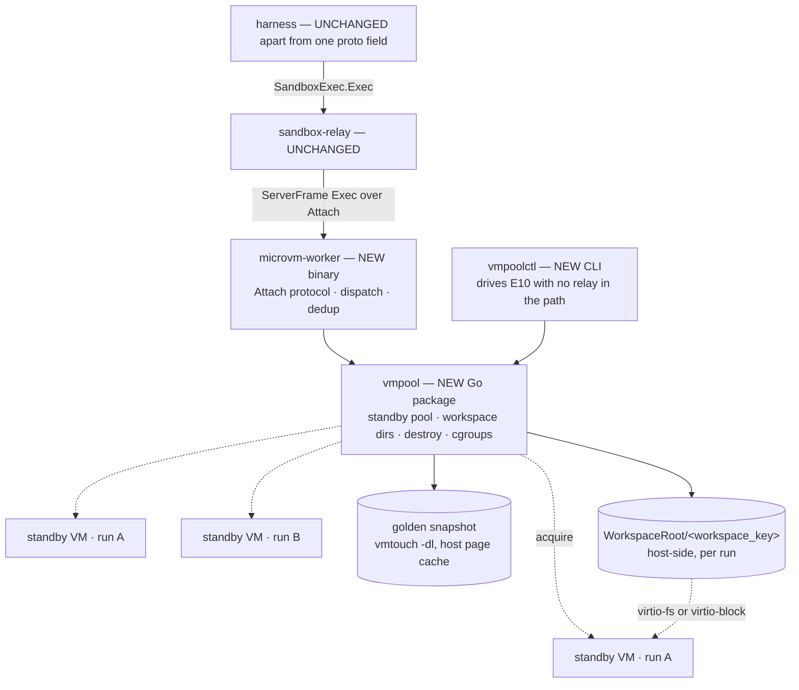

# P4 — MicroVM sandbox tier: a per-`Exec` microVM behind the existing wire contract — Design

Version: 1.0 — September 9, 2026
Status: Proposed
Scope: Replace the sandbox tier's `bash -c`-in-a-container with **one ephemeral microVM per `Exec`**,
warm-standby-provisioned so VM creation never happens inside a request, and measure what a single host
sustains (**E10** lifecycle primitives, **E11** density and the replenishment ceiling). Lands the
isolation slice [P4](https://github.com/rossoctl/serverless-harness/issues/57) that
[P6](2026-09-08-p6-vm-process-manager-design.md) §8 defers, on the VM substrate P6 establishes rather
than in-cluster.
Milestone: **P4**, in the existing `P` (two-tier rearchitecture) track. Source of truth for numbering:
[Milestone Registry](README.md).
Builds on (reuse, no redesign): the `Attach`/`Exec` wire contract and the Go worker that serves it
([ST4](2026-08-26-st4-go-reference-worker-design.md), [`remote-worker/DESIGN.md`](../../remote-worker/DESIGN.md));
the `SandboxTransport` seam and its gRPC relay path ([ST](2026-07-08-sandbox-transport-grpc-design.md),
[ADR-0024](../adrs/0024-sandbox-transport-remote-exec.md)); Redis presence + leases
([P2](2026-07-02-p2-shared-sandbox-pool-design.md)); the VM substrate, systemd packaging and model stub
([P6](2026-09-08-p6-vm-process-manager-design.md) §3.1, §4.4, §5.4); E6/E7's saturation machinery and
`detectKnee` ([P3.1](2026-07-03-e6-workload-parameterized-sandbox-load-design.md)).
Decision record: [ADR-0035](../adrs/0035-per-exec-microvm-warm-standby.md).

> **The one-sentence thesis.** A per-call microVM cannot be _created_ inside a request, only
> _acquired_ — so `<15ms` is not a restore-latency problem but a replenishment-throughput problem, and
> this design's whole job is to move every millisecond of VM creation into the gap the model's own
> latency already provides.

---

## 1. Goal & motivation

The sandbox tier's isolation boundary today is a container: `remote-worker` runs every command it
receives in a local `bash -c` (`remote-worker/DESIGN.md:1-5`). Agent-authored code — the output of a
model that repo content, tool output or the task itself may have prompt-injected — executes behind
namespaces and seccomp. This slice changes that boundary to KVM, at a per-call granularity, and
measures the cost.

Three properties are pursued, and only two are claimed:

- **Claimed: a boundary change.** Every `Exec` runs in a microVM created for it and destroyed after
  it, so no state and no compromise carries from one tool call to the next.
- **Claimed: density and throughput at that boundary**, on one host, with the bound attributed.
- **Not claimed: that the VMM cannot be escaped.** We claim the boundary moved from namespaces+seccomp
  to KVM, not that KVM is unbreakable. §9 keeps that out of scope deliberately.

**The registry's stated blocker for P4 has expired.** At `45a218d`, `docs/specs/README.md:84` **recorded**
P4 as "infra-gated: bare-metal pool vs Kata peer-pods vs gVisor — **no nested KVM on the m6i cluster**" —
pinned to that commit, and past tense, because **this slice rewrites that row**: after merge the same line
asserts the gate is retired, so the quotation is checkable at `45a218d` rather than at `HEAD`. Two
things retire that gate: AWS
[enabled nested virtualization on virtual EC2 instances in February 2026](https://aws.amazon.com/about-aws/whats-new/2026/02/amazon-ec2-nested-virtualization-on-virtual/)
(C8i / M8i / R8i, all commercial regions), and P6 establishes a non-Kubernetes VM substrate where a
bare-metal host needs no cluster at all. So the experiment can run on a cheap nested instance and be
confirmed on metal, instead of waiting for a bare-metal Kubernetes pool.

**Why a per-call VM rather than a per-session one.** A resident per-session VM is the conventional
shape and is cheaper to build, but it re-creates exactly the property this slice exists to remove:
state — and any compromise — persists across the tool calls of one run. Per-call teardown also
reclaims guest memory immediately, which is what makes the density arithmetic in §7.3 work. The cost
is that VM creation happens ~10× per tool call instead of once per run, and §3.2 is how that cost is
kept off the request path.

## 2. Current state — verified, with citations

Traced in the tree at `45a218d`, not inferred.

### 2.1 The wire contract already fits

| Fact                                                                                                      | Citation                         |
| --------------------------------------------------------------------------------------------------------- | -------------------------------- |
| Worker dials **out** to the relay, holds one full-duplex `Attach` stream; no inbound route needed         | `remote-worker/DESIGN.md:13-31`  |
| Registration **is** the live stream: presence written into `sh:sandbox:records` on open, removed on close | `remote-worker/DESIGN.md:29-30`  |
| Worker receives `ServerFrame{Exec}`, runs `bash -c`, returns `Chunk` then `End`/`ExecError`               | `remote-worker/DESIGN.md:1-5`    |
| `Abort` → SIGKILL the whole process group (`Setpgid`)                                                     | `remote-worker/DESIGN.md` table  |
| Worker-side `timeout_s` → SIGKILL → `ExecError{"timeout:<n>"}`                                            | `remote-worker/DESIGN.md` table  |
| `req_id` dedup: bounded LRU (256) guarded by a command+stdin fingerprint                                  | `remote-worker/DESIGN.md` table  |
| Dispatch pool `WORKER_MAX_CONCURRENT`, default 4                                                          | `remote-worker/DESIGN.md` step 3 |
| `base64 -d > file` **only terminates at EOF**, so stdin is fed and then closed                            | `remote-worker/DESIGN.md` step 4 |

Consequence: replacing the `bash -c` body with "acquire standby VM → push command over vsock → collect
→ destroy" needs **no new `SandboxTransport`** and therefore owes no new entry in the shared
conformance battery (`packages/k8s-sandbox/src/transport.ts:57-73`). Everything above
`select-sandbox` is untouched. This is the property that makes the slice affordable, and P6 §3.1a's
objection to a direct sandbox path — that it would be a fourth transport — does not apply.

### 2.2 The wire already classifies the two kinds of command

`proto/sandbox/v1/sandbox.proto:49-55`:

```protobuf
message Exec {
  uint64 req_id    = 1;
  string command   = 2;
  bytes  stdin     = 3;
  uint32 timeout_s = 4;
  bool   streaming = 5;   // true for bash/grep; false for read/write
}
message ExecRequest { string sandbox_id = 1; Exec exec = 2; }   // sandbox_id from the lease
```

`streaming` already separates agent-authored commands from harness-authored ones, and
`packages/k8s-sandbox/src/extension.ts:55-75` wires that split into two transport tiers:

| Tier              | Tools                                 | Command shape                                                                                                                                                                             |
| ----------------- | ------------------------------------- | ----------------------------------------------------------------------------------------------------------------------------------------------------------------------------------------- |
| `fastTransport`   | `read`, `write`, `edit`, `ls`, `find` | **Harness-authored templates, one shell-quoted path**: `cat ${q(p)}`, `base64 -d > ${q(p)}`, `test -e ${q(p)}`, `ls -1A ${q(p)}`, `stat -c %s ${q(p)}` (`operations.ts:24,34,67,128,136`) |
| `streamTransport` | `bash`, `grep`, user `!`              | **Fully agent-authored**: `createPodBashOps` takes an arbitrary `command` and wraps it (`operations.ts:99-108`)                                                                           |

This design routes **both** tiers into microVMs (§3.3). The split is retained as a **priced fallback**
that costs a one-line branch on `Exec.streaming`, not a redesign — see §7.2's decision rules.

### 2.3 What isolation is actually missing today

| Finding                                                                                                                                | Citation                                   |
| -------------------------------------------------------------------------------------------------------------------------------------- | ------------------------------------------ |
| **No path confinement.** `mapPath` returns paths outside the head cwd **unchanged** — "mirrors the SSH example's naive prefix replace" | `packages/k8s-sandbox/src/paths.ts`        |
| Shell quoting itself is **correct** — `shQuote` is the textbook `'` → `'\''` idiom                                                     | `paths.ts:2`                               |
| `podCwd` defaults to a single process-wide `/workspace`                                                                                | `config.ts:26`                             |
| Leases are keyed by **leaf run id**, not session ("member = leaf id"), with crash reclaim by expiry sweep                              | `harness/src/sandbox-lease.ts:3`, `:15-17` |
| One sandbox is leased to many runs under `KAGENTI_SANDBOX_CAP` — the 12–24:1 provisioning ratio P6 §3.1 sets K from                    | P6 §2.3, §3.1                              |
| `SANDBOX_TOKEN` is read from the **environment**, so it sits in `/proc/<pid>/environ`                                                  | `remote-worker/cmd/worker/main.go:95`      |
| Per-run `cwd` separation is an **open** item, not a solved one                                                                         | P6 §3.6, quoting P5 §4                     |

Composed, these are a concrete cross-tenant path today: an unconfined `cat` inside a container shared
by 12–24 runs can read a sibling run's workspace, and can read the relay bearer token out of
`/proc/<pid>/environ` — with which a caller can open its own `Attach` stream, be registered into
`sh:sandbox:records`, and receive other runs' `Exec` commands. This slice closes both, and §8's
cross-run-bleed test is what proves it.

### 2.4 Verified platform facts that shape the design

All from [Firecracker's snapshot documentation](https://github.com/firecracker-microvm/firecracker/blob/main/docs/snapshotting/snapshot-support.md)
unless noted. **Cloud Hypervisor's equivalents are unverified** — see §9's risk note.

| Fact                                                                                                                                                                     | Design consequence                                                                                                                     |
| ------------------------------------------------------------------------------------------------------------------------------------------------------------------------ | -------------------------------------------------------------------------------------------------------------------------------------- |
| **Listening vsock sockets survive restore** (CID updated); established connections are closed on resume                                                                  | The parked-in-`accept()` guest agent is documented behaviour, not a trick (§5.1). Connect **after** resume, never reuse across one     |
| Resuming one snapshot **more than once is documented as insecure** — IDs, RNG seeds, entropy pools and tokens are duplicated                                             | Forces §5.2's invariant: **nothing secret or unique in the golden snapshot**. VMGenID reseeds the kernel PRNG on Linux **≥ 5.18** only |
| Host resources must be reachable at the **same relative paths** as for the original process                                                                              | No drive-path patching. Use the jailer's **chroot per VM** and bind the run's workspace at a fixed path inside it (§5.3)               |
| Memory file is mapped **`MAP_PRIVATE`**, must be immutable, and must be retained for the VM's life                                                                       | The density mechanism: unmodified pages are shared host page cache across every VM. `vmtouch -dl` is required (§7.3)                   |
| Guest wall clock resumes from the snapshot moment                                                                                                                        | Set `clock_realtime: true`, or `date`, file mtimes and git timestamps are wrong in every VM (§5.3)                                     |
| **cgroups v1 causes high restore latency**; v2 strongly recommended                                                                                                      | Rig requirement, and the first thing to check if E10 reads slow                                                                        |
| Restore requires **identical hardware/software**                                                                                                                         | The golden snapshot is instance-generation-specific; build it on the target instance type, not on an arbitrary CI runner               |
| Diff snapshots are developer preview and generally not resumable                                                                                                         | Full snapshots only. No incremental strategy                                                                                           |
| Only a 64-bit CRC on the state file; snapshot, disk and memory files are **trusted**                                                                                     | The artifact is a trust boundary: root-owned, read-only, integrity-checked outside the VMM (§5.5)                                      |
| Integrators must provision disk space and **enforce quotas**                                                                                                             | Per-workspace quota (§6)                                                                                                               |
| **Firecracker has no virtio-fs** — block devices are its only host-sharing mechanism ([urunc VMM matrix](https://urunc.io/hypervisor-support/))                          | Decides §4.3's workspace mechanism, and is why Cloud Hypervisor is in scope at all                                                     |
| **virtio-fs DAX was removed** — virtiofsd dropped it in 2024, Cloud Hypervisor deprecated DAX-based virtiofs in 2022 ([TrEnv-X](https://arxiv.org/html/2509.09525v2) §3) | virtio-fs is FUSE-over-virtio round trips, not zero-copy host page cache. A cost to measure, not a correctness risk                    |

## 3. Architecture

### 3.1 Components



| Component        | New?                | Role                                                                                               |
| ---------------- | ------------------- | -------------------------------------------------------------------------------------------------- |
| harness          | **one proto field** | Populates `ExecRequest.workspace_key` (§3.4). No transport, no seam, no behaviour change otherwise |
| `sandbox-relay`  | unchanged           | Bridges `Exec`/`Abort` ⇄ the parked `Attach` stream                                                |
| `remote-worker`  | unchanged           | Becomes E10/E11's **container arm** — untouched, so it cannot regress                              |
| `microvm-worker` | **new binary**      | Same `Attach` wire contract; reuses `remote-worker`'s protocol code, links `vmpool`                |
| `vmpool`         | **new Go package**  | Lifecycle: golden snapshot, per-run standby pool + replenishment, workspace dirs, destroy, cgroups |
| `vmpoolctl`      | **new CLI**         | Drives E10 directly — no relay, no harness, no protocol confound                                   |
| guest agent      | **new**             | Static binary parked in vsock `accept()` at snapshot time                                          |
| golden snapshot  | **new artifact**    | Built offline with the agent parked; `vmtouch -dl`'d at daemon start                               |

**Three properties this topology is chosen for.** The harness cannot tell (§2.1) — no fourth
transport, no conformance-battery entry. The A/B is an **image swap**: both workers self-register
identically, so E11 varies the execution substrate and nothing else, which is P6 §5.3's
hold-everything-constant discipline one tier down. And lifecycle is **drivable without the stack**,
which is why it is a library with a CLI rather than an inlined function — E10 must measure the
production code path with no relay in it.

### 3.2 Warm standby: the load-bearing decision

Replenishment costs ~10–25ms (§7.2). That cannot sit inside a request with a 15ms budget. It does not
have to: within one leaf run, `Exec`s are separated by model round trips of hundreds of milliseconds.
So `vmpool` keeps **D standby VMs per active run**, restored and paused, and the request path is only:

```
pop Ready VM → vsock write → run → collect → SIGKILL → (async, after ReplenishDelay) replenish
```

This preserves the per-call property exactly — each VM still serves one `Exec` and dies — while moving
creation off the hot path. **`<15ms` is therefore met by relocation, not by a faster restore**, and the
design's real constraint becomes whether the host sustains
`Exec rate × replenishment cost`. §7 is built to answer that and nothing else.

**The refill is delayed, not immediate.** An unconditional refill after every `Exec` mints D standbys
for every run at the moment it stops needing them, which is the design's largest avoidable memory cost
rather than an edge case. §4.4 does that arithmetic and sets the grace window.

**Standbys are paused, not running.** Restore, then pause the VM. A paused VM takes **zero CPU**, so
thousands of standbys do not burn cores on timer ticks — which matters because §7.4's prediction is
that memory binds before CPU, and idle tick cost is the one thing that could falsify it for the wrong
reason. Resume-from-paused is far cheaper than restore-from-snapshot. Memory cost is identical either
way. The clock correction (§2.4) belongs at **resume**, not at restore.

**D defaults to 2, derived from code rather than taste.** `createPodEditOps` composes read + write
(`operations.ts:78-79`) and `read`'s error path fires a second `stat` (`:34`), so one tool call can be
two back-to-back `Exec`s with no model in between. A depth-1 pool would take a cold acquire on every
`edit`. E11 sweeps D.

### 3.3 Uniform, not split — and why the split stays cheap

Every `Exec` enters a microVM, including the five fixed-verb file-op families.

The rejected alternative was to route only `streaming=true` commands into VMs and leave file ops on the
container path. It would cut VM churn by the file-op:bash ratio, but it was rejected for three
reasons. It **keeps two execution substrates forever** — two boundaries, two path-confinement
implementations, two lifecycles, and a security claim needing a paragraph instead of a sentence. It
**cannot delete the container tier**, whereas uniform can: if nothing outside a VM touches the
workspace, the K shared containers lose their reason to exist and what remains is one VM launcher per
host, which the split needs anyway. And it would put agent-influenced execution **inside the
privileged process** (§3.5), which is strictly worse than today.

The split remains available as a **one-line branch on `Exec.streaming`** if E11's churn numbers demand
it (§7.2's third decision rule). Nothing in this design forecloses it.

### 3.4 The one wire change

`ExecRequest` gains `string workspace_key = 3`, populated by the harness from the lease's run id.
Empty means "today's single shared workspace" **on the container path only**, which is what makes the
field additive for `remote-worker` — it ignores it.

**`microvm-worker` refuses an empty `workspace_key`** with a counted `ExecError`, and this is the posture
the rest of §6 already takes ("never fall back to running commands on the host", "fail the unit at start"
rather than degrade). On the VM path there is no correct workspace to choose, so there is nothing to fall
back _to_, and an empty string would blind three separate safeguards at once: `WorkspaceRoot/<key>` (§4.4)
would collapse to one directory for every run, the per-run pools of §4.3 would all draw from one pool
whose mounted-workspace binding no longer distinguishes runs, and §6's "each VM carries its
`workspace_key` and `Exec` asserts the popped VM matches" — the row marked _catastrophic bug_ — would pass
trivially with every key equal. §8's cross-run-bleed gate cannot catch any of it, because it drives two
keys that are non-empty by construction. Refusing is one sentence; the alternative is the leak of §2.3
reached through the new door.

**Consequence, stated rather than discovered at step 6: the `/turn` path cannot use the VM tier in this
slice.** `run-turn.ts:57` resolves a single pod via `resolveSandboxConfig` and never leases, so it has no
run id to populate the key with — §10's file table changes `run-leaf.ts` only. That is consistent with §7,
whose experiments drive leaves, and it is recorded as out of scope in §9 rather than left as an empty key
that would quietly mean "share one workspace".

This is required for **correctness, not convenience.** Leases are keyed by run id
(`sandbox-lease.ts:3`) and nothing on the wire carries it, so without this field `vmpool` has nothing
to key a per-run workspace on — and consecutive leaseholders of one `sandbox_id` would inherit the
previous run's workspace. That is precisely today's situation with a process-wide `/workspace`
(`config.ts:26`) and precisely the leak §2.3 describes. A design that hid this to preserve a
"zero harness change" headline would be buying a talking point with a security bug.

**The harness's path mapping needs no change.** The run's workspace is bind-mounted at a **fixed path
inside each VM's jail** (`/workspace`), so `podCwd` stays `/workspace` and `mapPath`'s prefix
rewriting is unaffected. Per-run separation comes from the jail, not from the path.

### 3.5 Privilege

`microvm-worker` needs `/dev/kvm` and the right to spawn VMMs, where `remote-worker` is unprivileged.
Under uniform this is acceptable and the reason is load-bearing: **nothing agent-influenced ever
executes outside a VM**, so the privileged process only parses a frame, writes bytes to a vsock, and
spawns a VMM with fixed argv. §8 pins that property.

`virtiofsd` is a **separate matter and must not run as root.** With virtio-fs, guest path resolution
happens in `virtiofsd` on the host, which makes it the confinement boundary for the whole design — a
root `virtiofsd` compromise would be host root and would render the microVM boundary decorative. It
runs unprivileged with its own sandboxing (`--sandbox=namespace`).

## 4. The `vmpool` contract

### 4.1 Interface

```go
package vmpool

type Config struct {
    VMM                 VMMKind       // CloudHypervisor | Firecracker — the seam E10 prices
    SnapshotDir         string        // golden snapshots; vmtouch -dl'd at start
    WorkspaceRoot       string        // per-run workspaces
    StandbyDepth        int           // D, default 2
    GuestRAMBytes       int64         // the dominant density term (§7.3)
    MaxRuns             int           // concurrent workspace_keys; backstop only (§6)
    MaxCommittedBytes   int64         // memory-budget admission gate (§7.3)
    MemoryReserveBytes  int64         // host headroom never committed
    StandbyIdle         time.Duration // no Exec for this long → drop standbys, KEEP workspace; 90s (§4.4)
    WorkspaceIdle       time.Duration // no Exec for this long → delete the workspace too; 2h (§4.4)
    ReplenishDelay      time.Duration // grace before refilling a popped slot; default 200ms (§4.4)
    ReclaimScanInterval time.Duration // idle-host sweep tick; default StandbyIdle/4 (§4.2)
    MaxReclaimsPerScan  int           // VMs destroyed per sweep — rate-limits munmap; default 8 (§6)
}

type Sink interface{ Stdout([]byte); Stderr([]byte) }

type Pool interface {
    // Exec acquires a standby VM bound to key's workspace, runs exactly one
    // command, and destroys the VM before returning. A VM is NEVER reused.
    Exec(ctx context.Context, key string, e Exec, out Sink) (Result, error)
    // Reclaim drops a run's standby VMs AND its workspace directory — the full form.
    // Dropping standbys alone is internal to the sweep (§4.4).
    Reclaim(ctx context.Context, key string) error
    Stats() Stats
}
```

`Exec` is deliberately high-level rather than `Acquire`/`Destroy`: the VM handle never escapes the
package, destroy is a `defer`, and a caller cannot leak a VM by returning early. That is the one bug
class which would silently destroy the density number.

**Three call-site behaviours fall out of the existing contract for free**, and they collapse into one
code path: `ctx` cancellation (the relay's `Abort`) → kill the VM; `timeout_s` expiry → kill the VM →
`ExecError{"timeout:<n>"}`; success → kill the VM. **Abort, timeout and success all terminate in one
identical destroy path** — one teardown to implement, to test and to measure.

**Output cap: honour the existing pin, do not declare a new mechanism.** The declared-mechanism
contract belongs to the TypeScript transports (`transport.ts:57-73`); from the harness's view this path
is still `GrpcRelayTransport`, which declares `remote-abort`. `microvm-worker` therefore honours
`DEFAULT_OUTPUT_CAP` exactly as `remote-worker` does, where `BufferCap` is coupled to the TS constant
by `packages/k8s-sandbox/test/output-cap-coupling.test.ts`. Prefer capping **at source** in the guest
(`head -c`, the `producer-side-cap` trick `persistent-exec.ts` already uses) over moving 8 MiB across
vsock and discarding it.

### 4.2 Two state machines

**Per VM:**

```
Absent ──replenish──▶ Warming ──▶ Ready(paused) ──acquire──▶ InFlight ──done|abort|timeout──▶ Destroying ──▶ Absent
                         └─────────────────── spawn failure ──────────────────────────────────────────────────┘
```

**Per run (`workspace_key`):**

```
RunAbsent ──first Exec──▶ RunWarming ──▶ RunActive ──idle > StandbyIdle──▶ RunParked
RunParked ──Exec (cold acquire)──▶ RunWarming
RunParked ──idle > WorkspaceIdle──▶ RunReclaiming ──▶ RunAbsent
```

**`RunParked` is the state a run on a human gate or awaiting user input sits in**: workspace on disk,
**zero** standby VMs, costing disk rather than RAM. It exists because RAM should be released on the order
of a minute while the tree can age out lazily — not because either is unrecoverable (§4.4).

**The idle transition needs an actor, and `Exec` alone is not one.** Either threshold fires on the
_absence_ of work, so nothing in the request path can be relied on to notice it: the run that needs
sweeping is by definition the one issuing no requests, and a host whose last run went quiet receives no
further `Exec` to hang a sweep off. `vmpool` therefore sweeps **every key on every `Exec`** — a map walk
over at most `MaxRuns` entries, microseconds, not a timer per run — **and** on a `ReclaimScanInterval`
ticker in the pool's own goroutine, so an otherwise idle host converges to zero standbys. Still no
reaper daemon and no separate bookkeeping; §4.4 says why the tier above does not supply the trigger for
free.

**Acquire has two paths, and the distinction is E11's headline diagnostic.** A `Ready` VM present is a
**warm acquire** (~1–3ms, the design's target). None present is a **cold acquire**: block on the
warming already in flight rather than starting a second one, and **count it**. Cold-acquire rate is
what separates "this design works" from "this is a per-call restore with extra steps."

### 4.3 The workspace, and why the VMM choice is a correctness question

The workspace is mounted into the guest **during replenishment**, off the hot path — which is the
entire trick. A mounted VM is therefore bound to one workspace, so **pools are per-run, not global**. A
global pool would move the mount onto the hot path and give back everything §3.2 gained.

|                                 | **Cloud Hypervisor + virtio-fs**                                        | **Firecracker + per-run block image**                                                                                                                   |
| ------------------------------- | ----------------------------------------------------------------------- | ------------------------------------------------------------------------------------------------------------------------------------------------------- |
| Hot-path steps                  | vsock → run → kill (2 processes)                                        | vsock → run → **`sync`** → kill (1 process)                                                                                                             |
| Write durability across SIGKILL | Host FS is the authority; nothing is lost                               | Guest page cache dies with the VM → **`sync` is mandatory and on the hot path**                                                                         |
| **D > 1 standbys**              | Fine — the host filesystem arbitrates                                   | **Impossible as specified.** Two guest kernels mounting one ext4 rw corrupt it, and pre-mounted standbys do exactly that with _zero_ concurrent `Exec`s |
| Concurrent `Exec`s per run      | Fine                                                                    | Impossible — only one VM may hold the rw mount                                                                                                          |
| Replenishment                   | No mount step                                                           | Jailer chroot + guest mount                                                                                                                             |
| Processes per standby           | 2 (VMM + `virtiofsd`)                                                   | 1                                                                                                                                                       |
| Per-op cost in guest            | FUSE-over-virtio; **DAX removed** (§2.4)                                | Native block, fastest                                                                                                                                   |
| Path resolution                 | **On the host, in `virtiofsd`** — it is the confinement boundary (§3.5) | Inside the guest, against a block device — no host-side resolver                                                                                        |

**The D>1 row is decisive and it is a correctness constraint, not a preference.** ext4 is not a
shared-disk filesystem. So the Firecracker arm can only be measured with **mount-at-acquire**:
standbys restored but unmounted, mounting on the hot path (~1–5ms — and a fresh mount is _correct_,
since it reads metadata from the device, which also retires the stale-metadata hazard), with `Exec`s
serialized per run. E10 must measure that variant, not the pre-mounted one, or it is measuring
something incorrect.

**The seam stands anyway**, because virtio-fs is not free: it makes `virtiofsd` a load-bearing security
component and it removes host-side path resolution from the guest's control in a way that has its own
failure mode (§6). E10 prices both; §7.2 says how the result is read.

### 4.4 Workspace lifecycle, and why idle standbys are the accumulating cost

`WorkspaceRoot/<workspace_key>` is created on the first `Exec` for an unseen key and removed on
`Reclaim`. The worker never observes lease release, so reclamation is driven by idle thresholds — two of
them, for the reason immediately below.

**"Is the run finished?" is not answerable, and nothing here needs it answered.** A session can sit on a
human gate or on user input indefinitely, and no timer distinguishes that from a run that is over. But
what the design needs is weaker: that reclaiming **early** must be harmless. It is — but not because the
harness signals anything, and the two things it does do are both invisible to the worker:

| Bracket | Mechanism                                                                                              | Reaches the host dir? |
| ------- | ------------------------------------------------------------------------------------------------------ | --------------------- |
| Entry   | `convergeWorkspace` — idempotent, a no-op if the tree is there (`converge.ts:34`, `:38`)               | no                    |
| Exit    | `cleanupWorkspace` — an **`Exec`** running `worktree remove` in the guest (`converge.ts:44-51`, `:76`) | **no**                |

**Neither is host-side, so neither reclaims what `vmpool` allocated.** `cleanupWorkspace` is a command sent
_through_ the sandbox, scoped to `/workspace/leaves/<runId>`; it never touches `/workspace` or
`/workspace/repo`, and a guest cannot delete the host directory its own mount points at. The harness
brackets its **worktree**; the **workspace** is bracketed by nothing the worker can observe. So on the VM
path `WorkspaceIdle` is not a backstop — it is the **only** thing that ever deletes a workspace.

Two further reasons that `finally` is not a signal, either of them sufficient: `vmpool` cannot tell it from
any other `Exec` (marking it is precisely what §9's `Release` would add), and it is not even universal on
the container path — `:816` sits under `if (converging)` (`run-leaf.ts:813`, `:727`), so a verdict leaf
dispatched without `repoUrl`/`ref` never calls it, while `:665` hardcodes
`KubectlTransport(selected.config)` and so aims at a **pod**, which a single VM host does not have.

What the harness's behaviour _does_ establish is that **the workspace is a per-dispatch derivation, not
durable state** — three facts, and they are what make early reclamation free:

- The tree is a **detached worktree at a pinned commit** (`converge.ts:38`), so re-creating it yields the
  same bytes. A resumed verdict leaf re-converges to exactly what it had.
- Continuity across dispatches lives in the **Redis session log** (M5 checkpoints), never on the
  filesystem.
- The one leaf kind that holds uncommitted edits — a **solve** leaf — has no gate path at all
  (`realProduceSolve`): it converges, edits, `captureWorkspaceDiff`, and cleans up within one dispatch.

**So the thresholds are the mechanism, not a backstop — and both are safe to fire.** Nothing recovers state
they take; there is no state to take. Firing early costs a re-converge, never data:

| Threshold       | Default | Reclaims                     | Cost of firing early                 | Cost of firing late               |
| --------------- | ------- | ---------------------------- | ------------------------------------ | --------------------------------- |
| `StandbyIdle`   | 90s     | the run's paused standby VMs | one cold acquire on resume, ~25ms    | pinned RAM — the §7.3 term        |
| `WorkspaceIdle` | 30m     | the workspace directory      | a re-converge (fetch + worktree add) | retained disk — see §4.5's caveat |

Two thresholds rather than one because RAM is urgent and disk is not. **`WorkspaceIdle` is 30m rather than
the 2h an earlier draft of this section assumed**, because it is the sole deletion path and §4.5 makes each
retained workspace hold a **full repo fetch**: at 2h the disk high-water mark is every repo fetched in two
hours, and §2.4's per-workspace quota bounds each one without bounding the sum. The number properly follows
from §4.5's resolution — a host-shared repo mount leaves only a cheap worktree per run and the pressure
mostly goes away; a per-run clone does not — so 30m is the interim value, and §4.5 owns the final one.

**The tier above supplies the discipline but not the trigger.** `sandbox-lease.ts:15-17` notes that "a
dead leaf's member ages past its expiry and is swept by the next acquire", and that works there because
every acquirer touches **one shared ZSET** — a dead member is guaranteed to meet the next arrival. Here
the state is a **per-run map**, so nothing guarantees an arrival that would look at the quiet run. Same
shape (age out, no bookkeeping), but the trigger has to be stated rather than inherited, which is §4.2's
two-trigger sweep. A crashed run's workspace then ages out exactly as a dead lease member does.

**The accumulating case is the last `Exec` of every run, not a rare leak.** Every `Exec` schedules a
replenishment, so an unconditional refill hands D fresh standbys to a run at the exact moment it stops
issuing work, and they sit paused until the sweep. Two figures, because they price different things:

| Window                          | Runs finishing in it | Paused VMs (D=2) | At 256 MiB guests |
| ------------------------------- | -------------------- | ---------------- | ----------------- |
| 5 min — what a naive TTL costs  | ~100                 | 200              | **≈50 GiB**       |
| 90s — `StandbyIdle` as set here | ~30                  | 60               | **≈15 GiB**       |

The first prices the decision, the second the residual. Both are §7.3's dominant term spent on VMs that
will never serve a command; a per-run pool bounds the total (`MaxRuns × D`, gated by
`MaxCommittedBytes`), so this is not unbounded growth — it is the density number being quietly halved.
Two settings bound it further, and one honest limit remains:

1. **`ReplenishDelay` (200ms)** — wait before refilling a popped slot. A run's next `Exec` is separated
   by a model round trip of hundreds of ms (§3.2), so the refill still completes well before it arrives;
   the back-to-back case D=2 exists for (`operations.ts:78-79`, read + write with no model between) is
   served from the D−1 standbys still `Ready`.
2. **`MaxReclaimsPerScan` (8)** — reclaiming a host's worth of idle standbys is a `munmap` storm on the
   cores the hot path needs, so the sweep is rate-limited and convergence is a slope, not a stall (§6).

**`ReplenishDelay` cannot take the residual to zero, and the reason is the cleanup `Exec` above.** A
dispatch's _last_ wire event is `cleanupWorkspace`, arriving milliseconds after the last real `Exec`, and
`vmpool` cannot tell it apart from work: it pops a standby, refreshes the run's idle clock, and schedules a
refill that fires 200ms later with the run already over. So the delay shortens no window here — it only
helps where a run genuinely stops mid-stream. The residual is what the table above shows, and **only a
terminal signal removes it**, which is §9's `Release`. That is the honest case for taking `Release` into
this slice rather than a nice-to-have.

A gated run resuming therefore pays one cold acquire, which means **cold acquires must be attributed by
cause** (§7.3) — otherwise a gate-heavy or checkpoint-heavy workload reads as replenishment falling
behind when nothing is behind.

**Explicit release is what removes the residual, and it would be the first thing the worker can act on.**
A `Release{workspace_key}` variant on the **existing** `ServerFrame` oneof, emitted from the same
`finally` that calls `cleanupWorkspace` — not by that call, which never leaves the guest — would collapse
both idle windows to milliseconds, with `KubectlTransport` treating it as a no-op and `remote-worker`
ignoring it exactly as it ignores `workspace_key`. It needs **no** terminal-vs-`paused` distinction,
precisely because the workspace is per-dispatch: a resumed key re-converges. It would also have to cover
the `if (converging)` and hardcoded-`KubectlTransport` gaps noted above, which is a harness fix, not a
protocol one.

Held out of this slice because it is a **second** wire change and §3.4's "the one wire change" is
load-bearing for the claim that the harness is otherwise untouched. `Pool.Reclaim` (§4.1) is already the
entry point it would call, so adding it later changes no structure and no state machine. §9 records the
condition that pulls it in — and the residual arithmetic above plus §4.5's retained fetches are that
condition being partly met already.

### 4.5 The repo cache the per-run workspace would defeat — an owed decision

Tracing the lifecycle above surfaced a cost the per-run workspace imposes that §3.4 does not mention, and
it is larger than every millisecond this design optimises.

`converge.ts` keeps **one shared bare-ish repo per pod** at `/workspace/repo` and gives each leaf a
_worktree_ off it (`converge.ts:30-38`), fetching under a per-pod `flock` so concurrent converges
serialise instead of racing. That structure exists because a fetch is expensive and a worktree add is not.
Both paths live **inside** `/workspace`:

| Path                            | Today                                    | Under a per-run `/workspace`                        |
| ------------------------------- | ---------------------------------------- | --------------------------------------------------- |
| `/workspace/repo`               | shared across leaves on a pooled pod     | **empty per run** → `git init` + full fetch, always |
| `/workspace/leaves/<runId>`     | per-leaf worktree, cheap off a warm repo | the only part that was ever per-run                 |
| `/workspace/.sh-config/.refs/…` | shared bundle cache + refcounts (#216)   | per-run — a genuine **simplification**, see §5.1    |

The config-bundle half is an improvement and this spec already says so. The **repo half is a regression**:
every run pays a cold clone of the target repository, seconds for anything non-trivial, and the `flock`
serialises nothing because each dir has exactly one run. Worse, it lands where it is easy to misread —
E11's rungs would show throughput falling off with active runs and the obvious culprit would be
replenishment, not `git`.

Three shapes, undecided here because the choice wants E10's numbers:

1. **Two mounts.** A host-shared `/workspace/repo` (read-mostly, one mount shared by a host's VMs) plus
   the per-run rw dir for worktrees. Cheapest to reason about; needs the fetch lock to become host-level
   rather than per-pod, since the writers are now separate VMs.
2. **Per-run clone with `--shared` / `alternates`** against a host-side object store, so a run gets its
   own rw repo but the object database is not re-fetched.
3. **Accept the cold fetch** and pre-seed the golden snapshot's workspace image with the repos in play —
   viable for the experiment, not for a general deployment.

Whichever is taken, the per-run workspace must stop being the only mount, and **§7.5 must measure converge
separately from `Exec` latency** or the cost hides inside the rungs.

**This choice sets `WorkspaceIdle`, so the two decisions are one.** §4.4 makes that threshold the sole
deletion path, so every retained workspace holds whatever this section leaves in it: under option 1 a
worktree, cheap enough that the threshold barely matters; under 2 or 3 a full object store per run, where
the disk high-water mark is `(runs per WorkspaceIdle) × (repo size)` and 30m is already generous. Resolve
§4.5 first and the number follows; resolve it the other way and `Release` (§9) stops being optional,
because a timer measured in tens of minutes is the wrong instrument for gigabytes per run.

## 5. Guest image and golden snapshot

### 5.1 Contents

| Layer          | Contents                                                                                                                                                        |
| -------------- | --------------------------------------------------------------------------------------------------------------------------------------------------------------- |
| Kernel         | Minimal, no initrd, **≥ 5.18** (required for VMGenID's PRNG reseed, §2.4), cgroups **v2**, `clock_realtime` support                                             |
| Rootfs         | Read-only, shared across every VM on the host; the sandbox toolchain (`bash`, coreutils, the workload's dev tooling — cf. `docs/notes/swebench-image-facts.md`) |
| Writable layer | tmpfs in guest RAM (`/tmp`, `/var`) — discarded on kill. The workspace is the only durable thing                                                                |
| Guest agent    | Static binary parked in vsock `accept()` at snapshot time                                                                                                       |
| Parked `bash`  | Pre-forked, blocked on a pipe — see §5.4 for what it can and cannot serve                                                                                       |

### 5.2 Build procedure and the invariant that legitimises it

Built offline, **on the same instance type it will run on** (§2.4), versioned as an artifact:
boot → agent starts and forks `bash` → agent blocks in `accept()` → quiesce → snapshot → verify →
`vmtouch -dl` at daemon start.

Firecracker's documentation explicitly calls resuming one snapshot more than once **insecure**: IDs,
RNG seeds, entropy pools and tokens are duplicated, and while VMGenID reseeds the kernel PRNG on Linux
≥ 5.18, non-kernel state "**will** still be replicated." We use that pattern knowingly, so it needs a
stated mitigation:

> **Invariant: nothing secret or unique may exist in the golden snapshot.** All per-run identity
> arrives after resume — the workspace via a per-VM mount, the command over vsock. The guest holds no
> credentials by construction; `SANDBOX_TOKEN` lives in the worker on the host, never in a guest.

Duplicated guest ASLR is not a boundary we rely on: the attacker already executes arbitrary code
inside the guest, and our boundary is KVM. §8 pins the invariant with a test rather than trusting it.

### 5.3 The jailer chroot is how per-run workspaces work

Because host resources must be at the **same relative paths** as for the original process (§2.4), the
snapshot cannot point at a per-run file directly. Each VM therefore runs in its own **jailer chroot**,
with the run's workspace bind-mounted at the fixed path the snapshot expects, and the vsock backing
socket likewise. This removes drive-path patching from the design entirely.

`clock_realtime: true` is set, and the clock correction is applied at **resume**. Without it every VM
serves a stale wall clock and `date`, file mtimes and git commit timestamps are wrong.

**Firecracker's jailer has its own `--cgroup` arguments.** They must be configured consistently with
the systemd slice §6 relies on for cleanup, or the two mechanisms fight and the leak we are preventing
returns. (`setsid` is harmless — cgroup membership is inherited across it.)

### 5.4 The parked `bash`, and the one thing it cannot do

The dominant hot-path term is starting `bash`. Capturing the snapshot with a `bash` already forked and
blocked on a pipe, then writing the command and reading until a nonce, removes it. That is exactly
`persistent-exec.ts`'s framing discipline — the fast channel P6 §3.1a records the gRPC path as
_lacking_ — reimplemented inside the guest. It is safe here in a way it is not in a shared container:
the VM serves exactly one command in its life and is then destroyed, so the parked shell has no
cross-command state to leak.

**It cannot serve writes.** `base64 -d > file` only terminates at EOF
(`remote-worker/DESIGN.md` step 4), so the worker feeds stdin and **closes it** — and you cannot close
a long-lived parked shell's stdin without killing it. Commands that consume stdin therefore need either
a freshly forked child in the guest or a dedicated per-command pipe pair. An implementer hits this on
day one; it is written here so they do not have to discover it.

The guest agent protocol is **length-prefixed request, explicit response carrying the exit code**,
because Firecracker documents that "some vsock packet loss should be anticipated" for resumed guests
(§2.4). A missing or short response is an `ExecError`, counted — never coerced into a zero exit with
truncated output.

### 5.5 Snapshot fleet, versioning, integrity

**One golden snapshot per sandbox image.** `vmtouch -dl` pins each memory file, so the number of
images a host can serve warm is bounded by `Σ(memfile size)` in RAM, not by VM count — a real density
constraint E11 reports.

The artifact is pinned by a hash over kernel + rootfs + agent, verified at daemon start, and a stale
snapshot fails **loudly** rather than silently serving an old toolchain. Because only a 64-bit CRC
guards the state file and the VMM trusts these files (§2.4), they are root-owned and read-only, with
integrity checked outside the VMM.

The promoted config bundle needs no special handling: `run-leaf.ts:434` pushes a multi-MB bundle, and
since the workspace is host-side it lands there and is visible to every VM of that run for free —
better than today, where PR #225 needed a cache with reclaim-on-last-release.

## 6. Failure modes

| Failure                                             | Handling                                                                                                                                                                                                                                                                                                     |
| --------------------------------------------------- | ------------------------------------------------------------------------------------------------------------------------------------------------------------------------------------------------------------------------------------------------------------------------------------------------------------ |
| **Worker crash leaks VMs**                          | Per-VM cgroup under a systemd slice the unit owns; systemd kills the control group. On start, sweep the slice for orphans from a previous incarnation. Jailer `--cgroup` args must agree (§5.3). The #1 practical failure                                                                                    |
| **Host memory exhausted**                           | See below — the OOM killer must never arbitrate                                                                                                                                                                                                                                                              |
| **Workspace leak**                                  | `WorkspaceIdle` plus the start-of-day sweep are the **only** deletion path, triggered per §4.2 — the harness's own `finally` is an in-guest `Exec` that cannot reach the host directory (§4.4). **Per-workspace disk quota**, which §2.4 makes the integrator's job, bounds each workspace but not their sum |
| **Cleanup `Exec` looks like work**                  | `cleanupWorkspace` is a run's last wire event and is indistinguishable from work: it pops a standby, refreshes the idle clock and triggers a refill for a run that is over (§4.4). Bounded by `StandbyIdle`, removed only by §9's `Release`                                                                  |
| **Cold repo cache per run**                         | §4.5: the shared repo at `/workspace/repo` sits inside a per-run mount, so every run pays a full fetch — seconds, and easily misread in E11 as replenishment lag. An owed decision, plus §7.5's requirement to time converge separately                                                                      |
| **Idle standbys accumulate**                        | The systematic case, not a leak: an unconditional refill gives every finishing run D standbys it will never use (§4.4). `ReplenishDelay` suppresses that refill, `StandbyIdle` ages out the remainder, the ticker converges an idle host. Reported as **idle standby residency** (§7.1)                      |
| **Reclaim storm**                                   | Bulk `munmap` of many paused standbys contends with the hot path. `MaxReclaimsPerScan` bounds each sweep; E10 rung 4 prices paused and bulk teardown separately from in-flight                                                                                                                               |
| **Cold-acquire storm**                              | Standbys exhausted → every `Exec` pays full restore (~25ms) but stays correct. Counted, never queued unboundedly. Attributed by cause, so a gate-resumed run (§4.4) is not read as replenishment lag                                                                                                         |
| **Replenishment failure** (spawn fails, OOM)        | `ExecError`, exponential backoff per run pool. Never a hang                                                                                                                                                                                                                                                  |
| **Golden snapshot fails CRC**                       | The VMM terminates. Treat as **fatal for the host**: close the `Attach` stream — which removes presence via the existing mechanism (`DESIGN.md:29-30`) — and refuse, rather than degrade to zero standbys and blame latency on load                                                                          |
| **KVM unavailable at startup**                      | Wrong EC2 family, or nested virt not enabled. Given the C8i/M8i/R8i constraint this is the most likely operational failure. Fail the unit at start with an explicit message; **never fall back to running commands on the host**                                                                             |
| **`Attach` stream drops mid-`Exec`**                | Destroy that run's in-flight VMs immediately rather than waiting for `StandbyIdle`, or a flapping relay leaks VMs at the flap rate. The **workspace stays** — a relay flap is not a finished run                                                                                                             |
| **`Abort` for an already-destroyed VM**             | No-op, idempotent. The `req_id` LRU covers redelivery; abort-after-teardown must not error                                                                                                                                                                                                                   |
| **Guest agent wedged**                              | `timeout_s` → kill the VM. Not special-cased, because teardown is the same path as success (§4.1)                                                                                                                                                                                                            |
| **vsock packet loss**                               | Documented and expected (§2.4). Framed request/response with an explicit exit code; short response → counted `ExecError` (§5.4)                                                                                                                                                                              |
| **Output cap trip**                                 | Honour `DEFAULT_OUTPUT_CAP`; `truncated: true`, `exitCode: null`. Prefer capping at source in the guest (§4.1)                                                                                                                                                                                               |
| **Write lost across teardown**                      | Firecracker arm only: mandatory `sync` before kill, gated by §8's durability test. **Does not exist on the virtio-fs arm** (§4.3)                                                                                                                                                                            |
| **Malicious symlink or `..` in the workspace**      | virtio-fs arm: `virtiofsd` resolves guest paths **on the host**, so its own sandboxing is the boundary — configured and verified, never assumed (§3.5). Firecracker arm: resolution is in-guest against a block device, so the hazard does not exist — a genuine point in Firecracker's favour               |
| **A VM serves two `Exec`s, or the wrong workspace** | The handle never escapes `vmpool`; each VM carries its `workspace_key` and `Exec` asserts the popped VM matches. Cheap assertion, catastrophic bug                                                                                                                                                           |
| **Kernel limits mistaken for a density ceiling**    | `RLIMIT_MEMLOCK`, `vm.max_map_count`, `nofile`, `TasksMax`/`pid_max`. These fail at 500 VMs after working at 20, indistinguishably from a real ceiling. Raise and **record per run** (§7.5)                                                                                                                  |
| **Nested-virt vs metal divergence**                 | Record the substrate in every run record, mirroring P6 §5.2's requirement to record which basis a run used                                                                                                                                                                                                   |
| **Snapshot/host mismatch**                          | Pinned hash (§5.5) **plus a startup probe that actually restores one VM** and fails the unit if it cannot. Fail at start, not on a user's first request                                                                                                                                                      |

**Memory exhaustion, in full, because the naive behaviour is bad.** `vmtouch -dl` **mlocks** the memory
files, so the largest consumer is the one thing the kernel cannot reclaim. Swap is **off** — swapping
guest RAM destroys the latency this design exists for, and Firecracker's `mincore`-based dirty tracking
requires it off anyway. So pressure does not degrade; it goes straight to the OOM killer, whose
size-ranked favourites are the VMs doing real work, but which may equally pick `microvm-worker` (taking
down every run on the host) or a co-located Redis. Four mitigations, all in §4.1's `Config`:

1. **Per-VM memory is bounded a priori** by `GuestRAMBytes` — a guest's page cache and tmpfs live
   inside its own RAM, unlike a container's unbounded page-cache use. So the host budget is computable
   (§7.3) rather than empirical.
2. **`MaxCommittedBytes` / `MemoryReserveBytes`** gate admission and replenishment on that budget.
   `MaxRuns` alone cannot, because CoW growth is workload-dependent.
3. **`memory.max` on each VM's cgroup**, so a ballooning command is killed inside its own cgroup — one
   failed `Exec`, attributable, instead of a host-level lottery.
4. **Fail at startup** if `Σ(memfile)` for the warm image set does not fit with headroom.

A memory-driven refusal is recorded **distinctly** from a `MaxRuns` refusal, or the two ceilings get
conflated and neither is diagnosable.

**Admission control must be consistent with the tier above, or E11's rungs lie.** There is no "busy"
frame in the wire contract, so a `MaxRuns` refusal can only be an `ExecError`, which the harness sees
as a failed exec rather than back-pressure. The harness already has the right mechanism one tier up —
`SandboxPoolSaturatedError` at lease time under `KAGENTI_SANDBOX_CAP`. **So the lease cap is primary
admission control and `MaxRuns` is a backstop**, with the consistency requirement
`MaxRuns ≥ cap × (records this worker advertises)`. Violating it refuses work the harness believed it
had capacity for — precisely analogous to P6 §3.9's spurious `429`s truncating the rungs and making a
knee read early.

## 7. Experiments

### 7.1 The vocabulary, fixed before the driver exists

The dishonest number available here is "we ran 5,000 microVMs on one host" — standbys are paused and
CoW-shared, so that count inflates almost arbitrarily. Four quantities, kept apart (P6 §5.1's
discipline at this tier):

- **Concurrent in-flight `Exec`s** — VMs actually running a command. The resource-consuming quantity,
  and the only thing a knee applies to.
- **Active runs** — distinct `workspace_key`s with a live pool. Costs D standbys each, mostly idle.
- **Standbys resident** — total paused VMs. A memory-and-process statement, **not** a throughput claim.
- **Idle standby residency** — the subset held by runs with no `Exec` for longer than `StandbyIdle/2`:
  memory spent on VMs that will most likely never serve a command (§4.4). Kept separate from standbys
  resident because the two have different fixes — one is the design working, the other is it wasting.
- **Parked runs** — `RunParked` keys: a workspace with zero standbys. Disk, not RAM, and the quantity
  that must **not** be reclaimed early (§4.4).
- **Replenishment rate** — VMs created per second. The actual ceiling.

### 7.2 E10 — the lifecycle primitive ladder

A microbenchmark driven by `vmpoolctl` with **no relay and no harness** (§3.1). Its rungs are _terms_,
not concurrency.

| #   | Measures                                                                                                                                               | Why                                                                                                                                                  |
| --- | ------------------------------------------------------------------------------------------------------------------------------------------------------ | ---------------------------------------------------------------------------------------------------------------------------------------------------- |
| 1   | **Container baseline** — today's `Exec` round trip via `remote-worker`, trivial command and 1 MiB read. Plus the real **`Exec`-per-tool-call mix**     | Anchors everything. Without it, 15ms has nothing to be judged against — a 4ms baseline would make this a 3× regression bought for isolation          |
| 2   | **Warm hot path**, decomposed: vsock → run → response → teardown; parked-`bash` vs fresh `bash -c`                                                     | Prices §5.4 and answers the 15ms question directly                                                                                                   |
| 3   | **Replenishment unit cost** — spawn VMM (+`virtiofsd`) → restore → pause → ready. **Wall _and_ CPU time.** Cold memfile vs `vmtouch -dl`'d             | The CPU number is what §7.3 divides into host capacity. Wall time alone misleads                                                                     |
| 4   | **Teardown** — SIGKILL to reaped, including `munmap`. Three variants: an **in-flight** VM, a **paused standby**, and a **bulk reclaim** of D×R at once | The one term the sub-15ms literature assumes is free. Bulk reclaim is what §4.4's sweep actually performs, and the per-VM number does not predict it |

Cross-cut by **VMM** (Cloud Hypervisor + virtio-fs; Firecracker + block **with mount-at-acquire**, per
§4.3) and **substrate** (nested C8i, `*.metal`). Reported **as a floor**, per P6 §5.2's discipline — no
contention, no concurrency, so the real number can only be worse.

**Which number governs the middle band, decided now rather than after a rung produces 8ms.** The thesis
commits to `<15ms` and prediction 2 commits to "within 2× of the container baseline", and those two can
disagree about the same result: at rung 1's illustrative 4ms baseline they predict ~8ms, which satisfies
the target and fails the proceed threshold. **In the middle band the ratio governs**, because 15ms is an
absolute borrowed from the tool-call budget while the ratio is what the tier can actually be held to — a
1ms baseline would make 8ms an 8× regression that no absolute target would catch. `≥ 15ms` stays a hard
stop regardless of ratio, since past it the budget is gone whatever the container costs.

**Nested fires no stop rule.** It exists for iteration; metal is authoritative, which is what the
substrate cross-cut already implies. A nested result below the proceed thresholds is encouraging and a
nested result above them schedules a metal run — it never, by itself, stops the design or mandates the
split. Stating that is what closes the nested half of the gap, rather than inventing two more thresholds
for a substrate whose numbers we would not act on.

**Decision rules, written before the data, with per-substrate thresholds** because nested virt taxes
exactly the VM-exit-heavy work restore consists of:

| Result                                                                                              | Action                                                                                                                                                                                                                       |
| --------------------------------------------------------------------------------------------------- | ---------------------------------------------------------------------------------------------------------------------------------------------------------------------------------------------------------------------------- |
| Warm hot path **< 5ms metal / < 8ms nested** and replenishment CPU **< 25ms metal / < 40ms nested** | Proceed as designed. The VMM is then chosen on the correctness/security axis of §4.3, which cuts both ways                                                                                                                   |
| Warm hot path **[5, 15) ms metal**, or replenishment CPU **[25, 50] ms metal**                      | **Proceed, re-priced against the container baseline instead of against 15ms**, with the §3.3 split pre-authorised if the ratio exceeds 2×. See the paragraph below — this is the band the spec's own example numbers land in |
| Warm hot path **≥ 15ms on metal**                                                                   | The design fails on its own terms. Stop and reconsider per-session resident VMs (§9's rejected alternative)                                                                                                                  |
| Replenishment CPU **> 50ms metal**                                                                  | The split becomes **mandatory**, not a fallback — the one-line branch on `Exec.streaming` (§3.3)                                                                                                                             |

### 7.3 E11 — density and the replenishment ceiling

Through the relay, against P6 §5.4's model stub with its tool-call rate, driving the `Exec` mix E10
measured. Sweep concurrent **active runs** × D × `GuestRAMBytes`.

**The memory budget, which is computable rather than empirical:**

```
  Σ_images(memfile_size)          pinned, mlocked, un-reclaimable
+ standbys   × standby_footprint  small — restore + accept loop only
+ in_flight  × guest_ram          the hard per-VM ceiling
+ VMs        × VMM/virtiofsd overhead
+ host_reserve
```

Sketched at 256 MiB guests, 64 in-flight, 200 standbys, 4 images: `1 + 1.6 + 16 + 2` ≈ **21 GiB**. The
dominant term is `in_flight × guest_ram` by a wide margin, which makes **guest RAM the most powerful
density knob** — more than D or standby count — and is why it is a swept dimension rather than a
constant.

**Per-rung metrics:**

| Metric                                                                                                                                     | Attributes a knee to                                               |
| ------------------------------------------------------------------------------------------------------------------------------------------ | ------------------------------------------------------------------ |
| `Exec`s/sec, p50/p95                                                                                                                       | the rung itself                                                    |
| **Cold-acquire rate**                                                                                                                      | replenishment falling behind — the headline diagnostic             |
| Replenishment lag / queue depth                                                                                                            | the ceiling                                                        |
| **Σ PSS across VMM + `virtiofsd`** (`/proc/<pid>/smaps_rollup`), host `MemAvailable`, `Mlocked`, page cache, swap activity (expected zero) | the bound §7.4 predicts binds first                                |
| Process count, and the sysctl/rlimit values in force                                                                                       | a limit masquerading as a ceiling (§6)                             |
| Host CPU, and the fraction attributable to replenishment                                                                                   | the alternative bound                                              |
| `ExecError`s by cause — memory gate, `MaxRuns`, spawn failure, vsock short-response                                                        | a self-inflicted ceiling, each distinguishable                     |
| **Idle standby residency** (§7.1), and reclaim convergence time after a rung's last `Exec`                                                 | standbys paid for and never used — §4.4's accumulating case        |
| **Lease saturation one tier up**                                                                                                           | a harness-side refusal misread as a VM-tier limit — P6 §6's lesson |

**`StandbyIdle`, `WorkspaceIdle`, `ReplenishDelay` and `ReclaimScanInterval` are held at their §4.1
defaults and recorded, not swept.** They are second-order against guest RAM, and adding four dimensions
to `runs × D × GuestRAMBytes` would multiply the rung count for a term the memory arithmetic already
bounds. §7.4's fifth prediction is what makes them falsifiable at one setting; a rung that violates it
is the signal to sweep them, and §9's explicit-release trigger reads off the same metric.

> **Use PSS, not RSS.** With `MAP_PRIVATE` sharing, every VMM's RSS counts the shared memfile pages it
> has touched, so summing RSS across 200 processes multiplies the shared set by 200 — reporting ~50 GiB
> where the truth is ~2 GiB. A density claim built on RSS is wrong by more than an order of magnitude
> **in the pessimistic direction**, so it would cause us to abandon a design that works.

**A/B arm:** `remote-worker` vs `microvm-worker`, same driver, same relay, same stub — the image swap
of §3.1, so E11 varies the execution substrate and nothing else.

**Reuse `detectKnee`** (`experiments/src/sharing.ts:13`) with `degradeX=2` rather than writing a second
detector. Its contract: it takes `LadderPoint { c, throughput, p95Ms }` and **throws without a
`c === 1` baseline point**, so the ladder must include the single-run rung.

### 7.4 Falsifiable predictions

Recorded up front. **This spec introduces the practice rather than following one** — no spec on `main`
records predictions before its numbers, and `experiments/test/predictions.test.ts` is the SWE-bench
`predictions.jsonl` shape test, a name collision and not a precedent. To make the commitment binding
rather than reinterpretable once results arrive, the four below are written to
**`deploy/microvm/predictions.json` before the first rung**, with a test asserting the file is unchanged
after results land (§10's file table). A prediction that can be edited to fit the data is a hypothesis.

1. Replenishment binds on **process/memory count before CPU**.
2. The warm hot path lands **within 2× of the container baseline**, because both pay the relay hop and
   it dominates.
3. **The knee is a replenishment knee, not a latency knee**: cold-acquire rate stays ≈ 0 until
   replenishment rate meets `Exec` rate, then rises sharply. This predicts the knee's _shape_, a
   stronger commitment than a number.
4. Cloud Hypervisor's virtio-fs costs more per **metadata** op than Firecracker's block, visible in
   `ls`/`find`-heavy commands rather than in `cat`.
5. **Idle standby residency returns to zero** within `StandbyIdle + ReclaimScanInterval` of a rung's last
   `Exec` on an otherwise idle host, while **workspace count does not change** until `WorkspaceIdle`; and
   `ReplenishDelay` holds the post-final-`Exec` refill to **zero** VMs rather than D. This predicts the
   reclamation path's _shape_ — convergence without an arrival to trigger it, and RAM released long before
   state is — which is the half §4.2 says the tier above does not give us for free.

Prediction 1 is only observable as back-pressure because §6's memory gate exists. Without it the
prediction would be "confirmed" by the host falling over, which is not a measurement.

### 7.5 Measurement traps the driver must handle

Each of these would silently invalidate a rung.

| Trap                                  | Mitigation                                                                                                                                                                                                                                      |
| ------------------------------------- | ----------------------------------------------------------------------------------------------------------------------------------------------------------------------------------------------------------------------------------------------- |
| **Closed-loop driver hides queueing** | Waiting for each `Exec` before sending the next understates latency at saturation (coordinated omission) — exactly the regime prediction 3 lives in. Drive **open-loop / rate-based**, or declare the bias                                      |
| **Page-cache asymmetry between arms** | The container arm gets a warm host page cache for its rootfs; the VM arm gets `vmtouch`'d memfiles. Whichever runs second inherits the other's residue. **Randomize rung and arm order; drop caches between arms**                              |
| **Guest-side timing is garbage**      | Guest clocks jump on resume (§2.4). All per-`Exec` timing is **host-side only**                                                                                                                                                                 |
| **CPU frequency / thermal drift**     | Replenishment is a CPU burst; early rungs run at higher clocks. Pin the governor to `performance`, record clocks                                                                                                                                |
| **Warmup vs steady state**            | The first restore differs from the hundredth (page cache, THP, fragmentation). Discard warmup, report steady state, and soak long enough to see fragmentation drift                                                                             |
| **Kernel limits** (§6)                | Raise and record `RLIMIT_MEMLOCK`, `vm.max_map_count`, `nofile`, `TasksMax`, `pid_max` per run                                                                                                                                                  |
| **Converge hides inside the rungs**   | §4.5: a per-run `/workspace` means a cold repo fetch per run — seconds, which look exactly like a throughput ceiling. **Time converge separately from `Exec`**, report it as its own term, and record which of §4.5's three shapes the run used |

### 7.6 Where results live

Drivers in `deploy/microvm/`, results in `deploy/microvm/EXPERIMENTS.md`, pointer from
`docs/experiment-results.md` — the same driver-local / consolidated split E1/E3/E4 and E2/E5 already
use.

### 7.7 How the claim will read

> On a single «nested C8i | bare-metal» host, `microvm-worker` sustained **N concurrent in-flight
> `Exec`s** across **R active runs**, at p95 within X of the container baseline, with **every `Exec`
> executing in a microVM created for it and destroyed after it**. The bound observed was
> «replenishment throughput | host memory | process count». Standbys resident at that point: S — a
> memory statement, not a throughput claim.

## 8. Testing & verification gate

**Unit** (Go, `remote-worker/internal/vmpool`): acquire returns a `Ready` VM and marks it `InFlight`;
cold acquire blocks on the in-flight warming rather than starting a second; the popped VM's
`workspace_key` assertion; destroy is idempotent across abort/timeout/success; the memory gate refuses
at `MaxCommittedBytes` and records the refusal distinctly from `MaxRuns`. Four more on the reclamation
path, all with an injected clock and no KVM: the sweep fires from the **ticker** with no further `Exec`
arriving (the §4.2 case a request-triggered sweep cannot cover); `StandbyIdle` drops a run's standbys and
**leaves its workspace on disk**, so the next `Exec` for that key is a cold acquire against the same tree
rather than a fresh one; `ReplenishDelay` means a run's final `Exec` mints **no** replacement standby, while an `Exec` arriving
inside the delay window is still served; and a sweep destroys at most `MaxReclaimsPerScan` VMs, leaving
the rest for the next tick.

**Correctness gates** — none of these produces a number, and all are blocking:

| Gate                              | Asserts                                                                                                                                                                                                                                                                          |
| --------------------------------- | -------------------------------------------------------------------------------------------------------------------------------------------------------------------------------------------------------------------------------------------------------------------------------- |
| **Write durability**              | A file written in `Exec` N is intact in `Exec` N+1. **Both VMM arms** — this is the gate that catches a missing `sync`                                                                                                                                                           |
| **No cross-run bleed**            | Two interleaved `workspace_key`s; neither sees the other's files. _The_ property this slice exists for                                                                                                                                                                           |
| **Empty key is refused**          | An `Exec` carrying `workspace_key: ""` gets a counted `ExecError` from `microvm-worker` and runs nothing (§3.4). The complement of the container-arm pin below — without it, the bleed gate above tests a property that pin explicitly permits violating                         |
| **No VM reuse**                   | The `workspace_key` assertion holds under concurrency                                                                                                                                                                                                                            |
| **Snapshot holds no secrets**     | §5.2's invariant: scan the memory file for token patterns; assert no credential env in the guest                                                                                                                                                                                 |
| **Leak-free teardown**            | After N `Exec`s **across R completed runs**, VM process count returns to baseline within `StandbyIdle + ReclaimScanInterval` and workspace count within `WorkspaceIdle + ReclaimScanInterval` — bounds, because at test timescales "eventually" is indistinguishable from a leak |
| **Parked, then resumed**          | Drop a run's standbys at `StandbyIdle`, wait past it, then `Exec` the same `workspace_key`: it resumes on a cold acquire, against the same workspace, with no error. The property that lets RAM be reclaimed without knowing whether the run is over                             |
| **Reclaim, then re-dispatch**     | Reclaim a key's workspace outright, then `Exec` that key again: converge re-derives the tree at the pinned commit and the leaf proceeds. What makes `WorkspaceIdle` safe to fire at all (§4.4)                                                                                   |
| **Clock**                         | A VM's `date` is within a second of the host's — catches §5.3's wall-clock trap                                                                                                                                                                                                  |
| **Nothing executes outside a VM** | §3.5's privilege property: no `bash` child of `microvm-worker` on any code path                                                                                                                                                                                                  |

**Two regression pins for the container path**, because "we did not break the existing sandbox" must be
a fact and not a hope:

| Pin                                                                | Asserts                                                                                                                                                                                                                                                                                           |
| ------------------------------------------------------------------ | ------------------------------------------------------------------------------------------------------------------------------------------------------------------------------------------------------------------------------------------------------------------------------------------------- |
| `remote-worker` untouched                                          | Its test suite passes unchanged; `microvm-worker` is a separate binary, so the container arm cannot regress                                                                                                                                                                                       |
| `workspace_key` empty ⇒ today's behaviour **on the container arm** | The new proto field is additive: a new harness against `remote-worker`, and an old harness against `remote-worker`, both behave exactly as now. Deliberately **not** extended to `microvm-worker` — see the gate below, since "as now" there would mean one shared workspace for every run (§3.4) |

**A live gate, not a third experiment.** A small real-model run on the microVM path (E6's L1 workload,
c ≤ 6) proving the path is genuine end to end, gated `MV_LIVE=1` after the `E6_LIVE=1` convention. It
validates; it does not generate the headline number.

Homes: `remote-worker/internal/vmpool/*_test.go` for unit and gate tests that need no KVM;
KVM-requiring tests gated by an env var and skipped by default so `make test` stays green on a laptop.

## 9. Scope / YAGNI — explicitly NOT building

- **Per-session resident microVMs**, and **per-session snapshot-suspend between turns.** Both are
  cheaper to build and both re-create the property this slice removes: state and compromise persisting
  across a run's tool calls. Retained as the fallback if §7.2's second decision rule fires.
- **The `fastTransport`/`streamTransport` split.** Kept as a priced one-line fallback on
  `Exec.streaming` (§3.3), taken only if §7.2's third rule fires.
- **An explicit release signal from the harness.** A `Release{workspace_key}` variant on the existing
  `ServerFrame` oneof, sent from the `finally` that already calls `cleanupWorkspace`, making it the primary
  reclamation trigger with both idle thresholds as crash backstops (§4.4) — the same
  explicit-release-plus-expiry shape `sandbox-lease.ts` already uses. Deferred because it is a **second**
  wire change against §3.4's one, and because `ReplenishDelay` plus a 90s `StandbyIdle` should already
  bound the RAM cost. Pulled in when E11 shows **idle standby residency** (§7.1) is a material fraction of
  resident memory with both in force, or when prediction 5 fails. `Pool.Reclaim` is already its call site,
  so the deferral costs no rework.
- **The `/turn` path on the microVM tier.** It never leases (`run-turn.ts:57`), so it has no run id to
  populate `workspace_key` with, and §3.4 refuses an empty one on the VM path rather than letting it mean
  "share one workspace". Interactive sessions therefore stay on the container tier this slice; giving
  `/turn` a request-scoped key is the same plumbing MU2 owes it for pool selection.
- **Multi-host placement, discovery or rebalancing.** Single host, vertical only — same boundary P6 §8
  draws, for the same reason.
- **gVisor and Kata arms.** P4's registry row lists them; this slice takes the KVM/microVM arm only.
  Adding a second isolation technology before the first has a number would produce two half-measured
  arms.
- **Cost / resource-seconds accounting.** E11 compares capacity, not cost — P6 §8's boundary.
- **A claim that the VMM cannot be escaped.** We claim the boundary moved, not that it is unbreakable
  (§1).
- **Path confinement for the container path.** §2.3's unconfined `mapPath` is real, but on the microVM
  path the jail is the confinement, so fixing the container path is a separate change to a tier this
  slice replaces. Worth an issue; not worth coupling.
- **Getting `SANDBOX_TOKEN` out of the environment.** Also real (§2.3), also a `remote-worker` change,
  and mitigated here because no agent-influenced code runs in the worker's namespace at all. Separate
  issue.
- **macOS / libkrun.** No snapshot-restore equivalent to Firecracker's on Hypervisor.framework, so a
  Mac cannot produce this measurement. Dev convenience only.
- **Any `pi-fork` change.** None is needed.
- **Any new `SandboxTransport`.** The whole point of §2.1.

**The largest remaining unknown, stated as a risk rather than buried.** Every platform fact in §2.4 is
from Firecracker's documentation. **Cloud Hypervisor's equivalents are unverified** — vsock behaviour
across restore, path constraints, multi-resume guidance — and §4.3 leans on Cloud Hypervisor for
correctness reasons. If its caveats are worse or less documented, the design's preferred arm weakens.
Confirming them is E10's **first** task, not its last.

## 10. Implementation notes for a fresh session

**Files this slice touches**, decided rather than deferred so a planner does not have to choose:

| Path                                               | Change                                                                                 |
| -------------------------------------------------- | -------------------------------------------------------------------------------------- |
| `proto/sandbox/v1/sandbox.proto`                   | `ExecRequest` gains `string workspace_key = 3` (§3.4). Additive, backward-compatible   |
| `harness/src/run-leaf.ts`                          | Populate `workspace_key` from the lease run id — the only harness change               |
| `packages/k8s-sandbox/src/grpc-relay-transport.ts` | Pass `workspace_key` through on `Exec`                                                 |
| `remote-worker/internal/vmpool/`                   | **New** Go package — the `Pool` contract, both state machines, cgroups, workspace dirs |
| `remote-worker/cmd/microvm-worker/main.go`         | **New** binary — reuses `internal/session` protocol code, links `vmpool`               |
| `remote-worker/cmd/vmpoolctl/main.go`              | **New** CLI — drives E10 with no relay (§3.1)                                          |
| `remote-worker/internal/guestagent/`               | **New** — the in-guest static binary (framed vsock protocol, parked `bash`, §5.4)      |
| `deploy/microvm/`                                  | **New** — snapshot build script, systemd units, E10/E11 drivers, `EXPERIMENTS.md`      |
| `deploy/microvm/predictions.json`                  | **New** — §7.4's four predictions, written before the first rung, pinned by a test     |
| `docs/experiment-results.md`                       | Pointer to `deploy/microvm/EXPERIMENTS.md` (§7.6)                                      |
| `docs/specs/README.md`                             | P4 row: `planned` → this design                                                        |

**Go layout.** One module at `remote-worker/go.mod` (`github.com/kagenti/serverless-harness/remote-worker`,
go 1.25.0), with `cmd/worker` and `internal/{exec,relaytest,session}` today. New packages go inside it —
do **not** create a second module.

**`remote-worker` is not modified.** `microvm-worker` is a sibling binary sharing `internal/session`.
That is what makes §8's "the container arm cannot regress" pin a structural fact rather than a test
result, and what makes E11's A/B an image swap.

**A new TS package would need a `tsconfig.json`** with `test` in its include and a `typecheck` script,
or `harness/test/typecheck-coverage.test.ts` fails. This slice adds no TS package, but it does touch
generated proto output — regenerate rather than hand-edit `packages/k8s-sandbox/src/gen`.

**`make lint` skips untracked files** — stage new files first or it may lint nothing and pass.

**`make fmt` walks sibling worktrees** (Prettier ignores `.gitignore`). Prefer formatting the specific
files you changed over a repo-wide run.

**Worktree setup.** `link:` deps resolve inside the worktree, so a fresh one needs, in order:
`git submodule update --init --recursive`, then `cd pi-fork && npm ci && npm run build`, then
`pnpm install` at the root. `make typecheck` is `pnpm -r typecheck`. Tests needing Redis want the
`sh-test-redis` container on `:6379`.

**Git remotes here.** An HTTPS proxy MITMs GitHub with a private CA, so every `git` network command needs
the CA. Set it once — `git config --global http.sslCAInfo "$HOME/.cortex/ca/ca.crt"` — rather than passing
`-c http.sslCAInfo=…` on each command; that also fixes `gh`'s HTTPS calls, leaving only its
GraphQL-backed subcommands failing outright — for those use
`curl --cacert "$HOME/.cortex/ca/ca.crt" -H "Authorization: Bearer $(gh auth token)"` against
`api.github.com`.
`upstream` (kagenti) and `rossoctl` are the same repository after an org rename.

**Experiment rig.** E10/E11 need a host with `/dev/kvm`: a nested-virt EC2 **C8i/M8i/R8i** instance for
iteration, a `*.metal` instance for the authoritative number. cgroups **v2**, swap **off**, governor
pinned, and the golden snapshot built **on the instance type that will run it** (§2.4).

**Plans are not committed.** `docs/plans/` is gitignored and ephemeral by house convention
(`.gitignore:27-30`, `docs/plans/README.md`) — delete once coded.

**Commits.** `git commit -s` (DCO enforced in CI) and
`Assisted-By: Claude (Anthropic AI) <noreply@anthropic.com>`. Note the house convention is
`Assisted-By`, **not** `Co-Authored-By`.

**Suggested build order**, chosen so each step is independently verifiable:

| #   | Step                                                                                                     | Provable by                                                                                                                                                                                                                             |
| --- | -------------------------------------------------------------------------------------------------------- | --------------------------------------------------------------------------------------------------------------------------------------------------------------------------------------------------------------------------------------- |
| 0   | Verify Cloud Hypervisor's snapshot caveats against §2.4's Firecracker set                                | A written comparison; the §9 risk is retired or the design's preferred arm moves                                                                                                                                                        |
| 1   | Guest agent + golden snapshot build script (§5)                                                          | A snapshot restores and the agent answers one framed command over vsock                                                                                                                                                                 |
| 2   | `vmpool` + `vmpoolctl`, single run, D=1, no relay                                                        | One `Exec` runs in a VM and the VM is gone afterwards                                                                                                                                                                                   |
| 3   | E10 rungs 1–4 (§7.2)                                                                                     | The decision-rule table can be filled in                                                                                                                                                                                                |
| 4   | Workspace + jail + per-run pools, D=2                                                                    | §8's write-durability and cross-run-bleed gates pass                                                                                                                                                                                    |
| 5   | `workspace_key` proto field + harness population (§3.4)                                                  | The `workspace_key`-empty regression pin passes                                                                                                                                                                                         |
| 6   | `microvm-worker` on the `Attach` contract                                                                | A harness turn reaches a microVM through the real relay                                                                                                                                                                                 |
| 7   | cgroups, memory gate, systemd units, orphan sweep, the two-threshold sweep + `ReplenishDelay` (§6, §4.4) | Kill the worker mid-`Exec`; no VM and no workspace survives. Then let a busy host go quiet: standbys reach zero within `StandbyIdle + ReclaimScanInterval` with no arrival to trigger it, **and the parked workspaces are still there** |
| 8   | E11 sweep (§7.3)                                                                                         | A knee, plus the bound attributed to memory, process count or CPU                                                                                                                                                                       |

**Step 0 comes first** because §4.3's preferred arm depends on facts we have not verified, and every
later step's cost differs by arm.

## 11. References

- [ADR-0035](../adrs/0035-per-exec-microvm-warm-standby.md) — the decision this spec records.
- [P4 / #57](https://github.com/rossoctl/serverless-harness/issues/57) and
  [`docs/specs/README.md:84`](README.md) — the milestone and the infra gate §1 retires.
- [P6](2026-09-08-p6-vm-process-manager-design.md) — the VM substrate, the model stub with a tool-call
  rate (§5.4), the vocabulary discipline (§5.1), the missing gRPC fast channel (§3.1a), and §8's
  deferral of isolation to P4.
- [ST4](2026-08-26-st4-go-reference-worker-design.md) ·
  [`remote-worker/DESIGN.md`](../../remote-worker/DESIGN.md) — the wire contract this slice serves
  unchanged.
- [ST](2026-07-08-sandbox-transport-grpc-design.md) ·
  [ADR-0024](../adrs/0024-sandbox-transport-remote-exec.md) — the transport seam and its declared
  truncation mechanisms.
- [P2](2026-07-02-p2-shared-sandbox-pool-design.md) — Redis leases, whose expiry-sweep discipline §4.4
  copies.
- [P3.1](2026-07-03-e6-workload-parameterized-sandbox-load-design.md) ·
  [`deploy/knative/EXPERIMENTS.md`](../../deploy/knative/EXPERIMENTS.md) — E6/E7, `detectKnee`, and the
  knee-as-a-floor discipline.
- [#245](https://github.com/rossoctl/serverless-harness/issues/245) — the gRPC transport's missing
  persistent fast channel. §5.4 gets its benefit inside the guest, where the multi-tenancy problem that
  makes it delicate on the container path does not exist.
- [Firecracker snapshot support](https://github.com/firecracker-microvm/firecracker/blob/main/docs/snapshotting/snapshot-support.md)
  — every platform fact in §2.4.
- [AWS EC2 nested virtualization on virtual instances](https://aws.amazon.com/about-aws/whats-new/2026/02/amazon-ec2-nested-virtualization-on-virtual/)
  (Feb 2026) — C8i/M8i/R8i, which retires P4's infra gate.
- [urunc hypervisor support matrix](https://urunc.io/hypervisor-support/) — Cloud Hypervisor has
  virtio-fs; Firecracker does not.
- [TrEnv-X](https://arxiv.org/html/2509.09525v2) §3 — virtiofsd removed DAX in 2024; Cloud Hypervisor
  deprecated DAX-based virtiofs in 2022.

---

_Assisted-By: Claude (Anthropic AI) <noreply@anthropic.com>_
